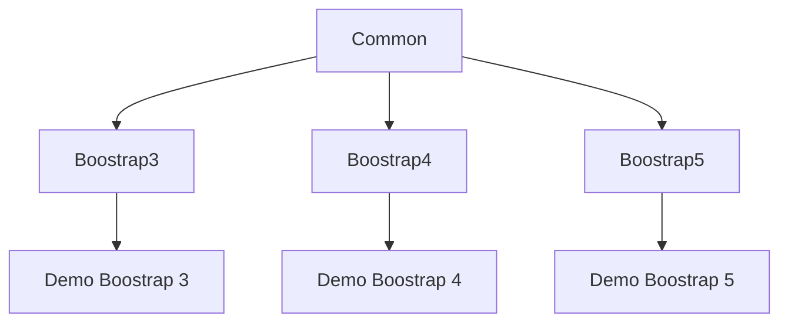

# Development

## General

The architecture of the library consists of 3 parts. The common library, the Bootstrap-specific library and the demo project for the specific Bootstrap version.

The logic of the controls is to be implemented in the common library. It does not contain any definitions about the rendering of the control

The markup for the respective Bootstrap version must be implemented in the Boostrap-specific library. No custom styles should be implemented, instead the standard Bootstrap classes should be used. In individual exceptions, specific styles may be necessary for the controls. However, this is only permitted if there is no other option and no styles may be used for colour definitions and shapes.



## Run

To start the environment, 3 projects must be carried out.

### Bootstrap 3

* Start Common: `npm run run-common`
* Start Boostrap3: `npm run run-bs3`
* Start Demo: `npm run demo-bs3`

### Bootstrap 4

* Start Common: `npm run run-common`
* Start Boostrap4: `npm run run-bs4`
* Start Demo: `npm run demo-bs4`

### Bootstrap 4

* Start Common: `npm run run-common`
* Start Boostrap5: `npm run run-bs5`
* Start Demo: `npm run demo-bs5`

## Build

To create a build without a live update, the following commands can be executed

### Common

```
npm run build-common
```

### Bootstrap 3

```
npm run build-bs3
```

### Bootstrap 4

```
npm run build-bs4
```

### Bootstrap 5

```
npm run build-bs5
```


# Documentation

To update all documentation, it is recommended to use the corresponding build command. This updates the documentation for all projects.

## Update all documentation

```ps1
./build.ps1 --target=doc
```

## Boostrap 3

This command only updates the Boostrap 3 documentation

```
npm run-script compodoc-bs3
```

## Boostrap 4

This command only updates the Boostrap 4 documentation

```
npm run-script compodoc-bs4
```

## Boostrap 5

This command only updates the Boostrap 3 documentation

```
npm run-script compodoc-bs5
```


# Testing

## Create/Edit Tests

To create or edit tests, execute the following command

### Boostrap 3

```
npm run test-edit-bs3
```

### Boostrap 4

```
npm run test-edit-bs4
```

### Boostrap 5

```
npm run test-edit-bs5
```


## Run Tests

The following commands are available to start the tests

### Full Run

This command is used for the tests for all projects.

```ps1
./build.ps1 --target=test
```

### Boostrap 3

```
npm run test-bs3
```

### Boostrap 4

```
npm run test-bs4
```

### Boostrap 5

```
npm run test-bs5
```

## Problems

### Type DynamicModule does not have 'ɵmod' property.

If these error messages are displayed during a test, the NGCC must be executed again. To do this, execute the following command.

```
npm run ngcc
```

# Build Pipeline

## Requirements

The following command must be executed for the Powershell script to be executed, Otherwise the following error is displayed:

```
./build.ps1 : File C:\Daten\jNetwork\ch.jnetwork.angularcontrols\build.ps1 cannot be loaded because running scripts is disabled    
on this system. For more information, see about_Execution_Policies at https:/go.microsoft.com/fwlink/?LinkID=135170.
At line:1 char:1
+ ./build.ps1
+ ~~~~~~~~~~~
    + CategoryInfo          : SecurityError: (:) [], PSSecurityException
    + FullyQualifiedErrorId : UnauthorizedAccess
```

Command to correct the problem

```
Set-ExecutionPolicy RemoteSigned -Scope CurrentUser
```


## Build

To perform the build process for all projects, execute the following command in a Powershell

```
build.ps1
```

## Test Run

To execute all tests in a Powershell, execute the following command

```
build.ps1 --target=test
```

## Documentation

To update the documentation, execute the following command in a Powershell

```
build.ps1 --target=doc
```

## Release erstellen

To create a release, execute the following command in a Powershell

### Patch

```
.\build.ps1 --target=release --patch
```

### Minor

```
.\build.ps1 --target=release --minor
```


### Major

```
.\build.ps1 --target=release --major
```

### Release Preview
```
.\build.ps1 --target=release --prerelease
```

### Optional parameters

`--nopublish`

Does not publish the package in the NPM registry

`--notest` 

Deactivates the Cypress tests
